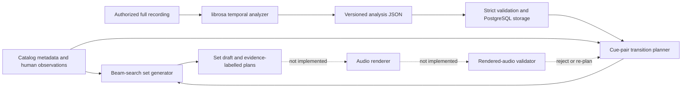

# Automated DJ set generation and mixing research

**Status:** engineering research and implementation guide

**Last reviewed:** 2026-08-13

**Companion contract:** [MIX_ENGINE.md](MIX_ENGINE.md)

This document records the research behind Cueflow's set generator, temporal
audio analysis, transition planner, future renderer, and evaluation program.
It is deliberately more ambitious than the current implementation while being
strict about what the application can prove today.

The short verdict is:

- Cueflow is already a credible **set-sequencing and transition-planning
  prototype**. Its provenance, explicit confidence, risk escalation,
  cue-window plans, and weakest-link set scoring are unusually honest.
- Cueflow is **not yet an automatic DJ mix engine**. It does not render an
  overlap, hear the result, measure the rendered result, or learn from DJ
  judgments.
- Waveform-derived evidence is considered only on a temporal edge. The stored
  100 ms waveform overview is not itself an input to the transition score;
  derived peak/RMS and STFT features in cue windows are. Metadata-only edges
  consider no waveform or time-local audio.
- A festival-grade system cannot be obtained by tuning one larger weighted
  score. It needs a closed loop: analyze, propose, render, validate, re-plan,
  and calibrate against blinded human ratings.
- Great track order and great blends are coupled but distinct optimization
  problems. The recommended architecture precomputes several executable,
  validated transition options for each plausible track pair, then searches
  globally for a set whose narrative and transitions are both strong.

“Festival-grade” is used below as a product target, not as a measurable claim
about any promoter, performer, or event. For Cueflow it means: musically
intentional sequencing, phrase-correct and artifact-free transitions,
controlled loudness/headroom, useful variation, no catastrophic edge, and a
high success rate in blinded DJ evaluation.

## How to read the evidence

Every recommendation falls into one of three evidence classes:

| Class | Meaning |
| --- | --- |
| Published finding | A paper, standard, or official implementation directly supports the statement. |
| Industry behavior | Professional DJ software exposes the behavior, but that does not establish that its proprietary implementation is optimal. |
| Cueflow inference | An engineering conclusion drawn for this product. It must be tested and must not be presented as a published result. |

The online survey intentionally favors primary sources: original papers,
standards, official project documentation, and official DJ-product manuals.
Thresholds in papers are useful priors, not universal laws for every genre,
master, crowd, or playback system.

## Current Cueflow system

The present implementation has two evidence paths and one designed future
path:



The relevant implementation is:

- [set search and draft scoring](../internal/generator/generator.go)
- [temporal cue-pair scoring](../internal/generator/temporal.go)
- [analysis-domain validation](../internal/domain/analysis.go)
- [strict JSON import contract](../internal/analysisjson/json.go)
- [full-track analyzer](../scripts/analyze_tracks.py)
- [storage and identity rules](../internal/store/analysis.go)
- [transition evidence UI](../frontend/src/components/SetInspector.tsx)

### What the full-track analyzer actually computes

`cueflow-librosa/1.0.0` currently:

1. Decodes the authorized recording, resamples to 22.05 kHz, and averages
   stereo channels to mono for analysis.
2. Fingerprints the source file with SHA-256.
3. Stores a 100 ms RMS/peak overview waveform.
4. Builds a spectral-flux onset envelope and a librosa beat grid.
5. Forces the global tempo into 70–180 BPM by repeated half/double-time
   conversion.
6. Estimates four-beat bar phase by choosing the strongest of four beat-accent
   phases.
7. Computes two-second frames containing RMS, peak, windowed LUFS, low/mid/high
   power share, spectral flux, harmonic/percussive share, a vocal proxy,
   tonal strength, and 12-bin chroma.
8. Creates coarse 32-bar structural blocks and labels them from local energy.
9. Enumerates complete 16-bar windows beginning on estimated downbeats and
   ranks early/late clean windows plus interior low/high-energy extrema as cue
   candidates.

This is meaningful temporal analysis, but several names are stronger than the
underlying evidence:

- The “downbeat” is an accent-phase heuristic, not a trained downbeat/meter
  model.
- The vocal probability is roughly harmonic-share × mid-band-share, not vocal
  detection or source separation.
- The structural map is a fixed 32-bar partition with heuristic labels, not
  learned or novelty-based structural segmentation.
- Two-second integrated-loudness calls are useful local loudness estimates,
  but the result is not explicitly classified as EBU Momentary, Short-term, or
  programme Integrated loudness.
- Stereo image and phase are unavailable after the mono downmix.

The strict schema, source fingerprint, analyzer version, duration check, and
confidence fields prevent these limitations from being silently upgraded into
ground truth.

### Is the waveform considered?

Yes, but only in a qualified sense.

| Evidence | Captured? | Used in ordering/transition score? | Current effect |
| --- | ---: | ---: | --- |
| Stored 100 ms overview waveform array | Yes | **No, not directly** | Available as validated analysis evidence and for future visualization/inspection. |
| Cue-window RMS/peak from decoded samples | Yes | **Yes** | Predicts midpoint headroom and contributes to cue metrics. |
| STFT low/mid/high energy | Yes | **Yes** | Penalizes low-band collision and describes local spectral balance. |
| STFT chroma | Yes | **Yes** | Scores tonality inside the proposed overlap. |
| HPSS-derived percussion/tonality | Yes | **Yes** | Scores groove continuity and feeds the vocal proxy. |
| Local loudness estimate | Yes | **Yes** | Proposes incoming trim and penalizes loudness mismatch. |
| Stereo phase/correlation | No | No | Cannot currently detect cancellation or width collapse. |
| Isolated vocal/bass/drum stems | No | No | Vocal and bass collisions remain estimates from the mixture. |
| Rendered overlap waveform | No | No | No proof that automation actually sounds good or avoids clipping/artifacts. |

So the accurate UI statement is **“waveform/STFT-informed cue plan; render
validation required”**, not “waveform-verified mix.” A transition with missing
analysis correctly falls back to `metadata-only` and must never inherit an
audio-aware label from other edges in the draft.

### Current set generation

The generator performs deterministic beam search with 42 retained states and
14 branches per state. Each partial state tracks ordered tracks, used tracks,
transitions, full-track duration, and cumulative utility. The candidate step
is:

```text
candidate utility =
    0.45 × previous-edge score
  + 0.22 × requested energy-arc fit
  + 0.24 × requested BPM-curve fit
  + 0.09 × set-role fit
  - confidence/risk/repetition penalties
  + required-track and exploration terms
```

Tempo compatibility uses the best direct, half-time, or double-time
interpretation:

```text
adjustment = min(|candidate × {0.5, 1, 2} - reference| / reference)
tempo fit  = exp(-adjustment_percent / 6.5)
```

Final state selection adds duration fit, whole-set BPM-curve fit,
weak-link transition safety, high-risk penalties, closer role, and ending BPM.
It requires all mandatory tracks and a full-track sum within 90–110% of the
requested duration.

The requested energy arcs are hard-coded curves over elapsed full-track time,
not curves learned from sets or the audio's local energy contour:

| Arc | Current target behavior |
| --- | --- |
| `roller` | Rises from about 0.48 to 0.80 with two small sinusoidal waves. |
| `peak` | Rises from 0.52 to 0.98 by 82% of the set, then eases to 0.85. |
| `sunset` | Rises from 0.25 to 0.73 by 70%, then eases to 0.55. |
| default / journey | Rises from 0.31 to 0.90 by 72%, then eases to 0.68. |

Role fit similarly maps static `opener`, `builder`/`bridge`, `reset`,
`lifter`/`peak`, and `closer` labels to preferred progress ranges. Those are
useful brief controls, but the labels come from catalog evidence rather than a
time-local understanding of what the recording is doing when it is played.

This is substantially better than sorting independently by BPM, key, or
energy: beam state preserves earlier choices, local edge quality matters, and
multiple variations penalize reusing the same tracks and edges. But it is not
yet a complete set optimizer:

- Duration is the sum of full tracks. It does not subtract overlaps or account
  for early mix-outs, late mix-ins, loops, or shortened play regions.
- The selected-search objective and the displayed `qualityScore` are related
  but not identical. A displayed score is an audit metric, not the exact
  optimization target.
- The edge score, BPM curve, and final tempo terms can prioritize tempo more
  than a reader might infer from one displayed table.
- Track energy and role are global labels. A track can contain a long intro,
  false drop, breakdown, and final peak that one scalar cannot express.
- Genre compatibility is a small hard-coded matrix, and Camelot compatibility
  is a coarse global-key prior.
- Narrative memory is limited. The state does not track tension/release,
  recent vocal density, timbral motifs, transition-style repetition, novelty,
  planned resets, or signature moments.
- Only the best cue pair is retained per edge; the global search cannot choose
  a slightly lower-scoring transition that better serves the set narrative.
- A fixed beam can prune a temporarily awkward move whose payoff appears many
  tracks later. No optimality bound is claimed.

### Current transition planning

The metadata fallback is itself a weighted model. Harmonic strictness sets the
harmonic weight from 14% to 38%; the remaining weight is divided among tempo
(34%), groove (31%), vocals (19%), and energy step (16%). The raw score is
multiplied by `0.72 + 0.28 × minimum track confidence`; missing confidence is
treated as 0.5 rather than as certainty.

Camelot scores are 1.00 for the same key, 0.92 for relative major/minor, 0.96
for an adjacent wheel number in the same mode, 0.68 for two steps in the same
mode, 0.62 for an adjacent number with a mode change, and 0.24 otherwise.
Groove compatibility is a small hand-authored matrix; vocal safety is
the clipped value `1 - outgoing_vocal × incoming_vocal × 1.1`; and large
absolute energy steps are penalized. These are transparent priors, not learned
probabilities.

Metadata risk becomes high below 0.48 score, above 10% tempo adjustment, or
below 0.55 confidence. It becomes at least medium below 0.68 score, above 5%
tempo adjustment, below 0.75 confidence, or below 0.45 vocal-safety. These
thresholds are engineering choices and have not been perceptually calibrated.

When both tracks have valid temporal analysis, every compatible outgoing and
incoming cue pair is evaluated. Current cue score weights are:

| Component | Weight | Evidence |
| --- | ---: | --- |
| Analyzed tempo | 15% | Full-track beat estimate |
| Phrase length | 17% | Ratio of outgoing/incoming bar counts |
| Low-band overlap | 14% | Mixture STFT band shares, partially credited for planned EQ |
| Vocal overlap | 17% | Mixture-based vocal proxies |
| Loudness | 11% | Difference between local window estimates |
| Percussive continuity | 8% | HPSS mixture features |
| Tonality | 8% | Local normalized chroma similarity |
| Headroom | 10% | Approximate constant-power midpoint from local peaks |

The result is blended 62% temporal / 38% metadata, and temporal evidence can
only maintain or increase metadata risk. The plan contains exact time ranges,
bars, a style, bass-swap bar, incoming trim, and crossfader/low-EQ automation.

Important limitations:

- Phrase score currently compares window lengths. Because all generated
  windows are normally 16 bars, this does not prove phrase boundaries or
  musical-sentence alignment.
- Candidate windows begin on every estimated downbeat and are not constrained
  to the separately generated section boundaries.
- The midpoint peak formula cannot know whether peaks coincide, their phase,
  inter-sample true peak, limiter behavior, or time-stretch overshoot.
- Crediting a planned low-EQ exchange before rendering is an optimistic model,
  not evidence that the two basslines stop masking each other.
- The crossfader and EQ lanes are control intentions; their actual curves,
  filter topology, smoothing, latency, and renderer semantics are undefined.
- `echo-out`, `drum-led`, and `drop-swap` are style labels. There is no echo,
  stem isolation, loop, or drop-aware audio processor yet.
- Picking the maximum estimated cue score creates winner's-curse risk: a noisy
  feature can make one candidate look better than it is. Retaining top-K plans
  and rendering them is safer.

### Current set-level score

`heuristic-fit-v2` reports:

```text
20% energy arc       15% tempo flow       12% harmonic flow
 8% diversity        15% duration fit      8% ending role
17% edge safety       5% analysis confidence
```

Edge safety is deliberately robust rather than an average:

```text
edge safety = 0.60 × edge-score 10th percentile
            + 0.40 × minimum edge score
```

Any high-risk edge caps the total at 74, with a lower cap for further high-risk
edges. This is a strong design choice: one train wreck should not disappear in
the average of otherwise easy blends. The remaining weakness is semantic, not
arithmetic—the inputs are still heuristic or pre-render estimates.

The number is not a probability that a DJ or crowd will like the set. Compare
drafts only with their `scoreVersion`, evidence coverage, catalog, and brief in
view. A weight/model change must advance the version; cross-version score
movement is not evidence of an audible improvement without a fixed benchmark.

### Evidence-based rating of the current system

These are engineering maturity ratings, not listening-test results. A score of
10 means the capability is implemented, reproducibly validated on a diverse
benchmark, calibrated against expert listeners, and production-operable.

| Capability | Rating | Why |
| --- | ---: | --- |
| Provenance and honesty | **8.5/10** | Versioned evidence, source fingerprints, strict import, confidence, explicit metadata/temporal/rendered vocabulary, and no fabricated features. |
| Catalog/set constraints | **7.0/10** | Required/excluded tracks, grooves, duration envelope, BPM endpoints, arcs, roles, exploration, and deterministic variations are useful. Mixed-runtime planning is absent. |
| Global set narrative | **5.5/10** | Beam search, arc and role progression beat simple sorting, but there is little long-range musical memory or deliberate tension/release grammar. |
| Beat/downbeat/phrase analysis | **4.5/10** | Full-file beat markers and confidence exist; bar phase and structure are heuristics and have no benchmark results. |
| Waveform/time-local analysis | **6.0/10** | Real full-track sample/STFT features are used per cue. Stereo, phase, stems, multiresolution descriptors, and calibrated uncertainty are missing. |
| Cue selection | **5.5/10** | Concrete 16-bar candidates and exhaustive compatible pairing are valuable; candidates are not true learned/novelty section boundaries. |
| Transition planning | **6.0/10** | Exact windows, risk, local features, style, gain/EQ/fader lanes, and weakest-link treatment form a solid planner. No audio execution exists. |
| Audio rendering | **0.0/10** | Not implemented. |
| Render validation/mastering | **0.0/10** | No true-peak, loudness, phase, masking, or artifact test is run on an overlap or complete set. |
| Human perceptual calibration | **0.0/10** | No blinded Cueflow listening study, expert-label corpus, or learned calibration set exists. |
| **Overall automatic-mix readiness** | **3.5/10** | Stronger than the number sounds as a planner; far from defensible as a finished automatic DJ. Rendering and evaluation dominate the gap. |

The current code can plausibly produce promising orders and executable-looking
plans. It cannot establish how often those plans sound professional. Raising
that last rating requires rendered evidence, not cosmetic score inflation.

## Findings from published automatic-DJ systems

### Sequencing and transition placement should be separate, coupled stages

Spotify's [Automatic Playlist Sequencing and Transitions][spotify-apt]
represents songs as a graph for ordering, then optimizes overlap locations with
time-local feature-distance matrices. Sequence features include learned
acoustic/timbral representations, circle-of-fifths key geometry, and log-tempo.
Transition candidates are restricted to downbeats, strongly favor structural
boundaries, and are searched near the end of the outgoing song and beginning
of the incoming song. The renderer aligns beats and changes beat duration
across the transition.

That work is especially useful because its professional-curator evaluation
reported failure reasons, not just a mean preference. Beat misalignment was
the dominant reported transition fault; vocal overlap, song contrast, awkward
points, and non-downbeat entry also appeared. Harmonic clash was not reported
in that small, tempo-constrained evaluation. The Cueflow inference is not
“ignore key”; it is “correct beat/downbeat/phrase timing and local overlap
content deserve at least as much engineering effort as Camelot rules.”

The paper also demonstrates that interpretable feature matrices remain useful
even when learned embeddings are available. Cueflow should keep explainable
components while improving their evidence.

### Cue-point selection is a distinct learnable problem

[Automatic Detection of Cue Points for DJ Mixing][cue-points] derives EDM cue
rules from DJ interviews and applies novelty/feature analysis. Its reported
expert evaluation found roughly 96% of generated cue points usable for DJ
mixing. This supports a dedicated cue-candidate model rather than treating any
downbeat in an early/late time range as equivalent.

The key Cueflow implications are:

- detect structural change and phrase function before ranking cleanliness;
- keep multiple cue functions—intro, phrase-in, breakdown, drop, phrase-out,
  outro—rather than one universal point;
- store the reasons and confidence so candidates can be reviewed and improved;
- evaluate cue correctness independently from the quality of the rendered
  transition that uses it.

### Real DJ mixes are a dataset, not merely inspiration

[Mix-to-Track Subsequence Alignment][dj-mix-alignment] uses dynamic time
warping robust to tempo and key changes to align 1,557 real mixes with 13,728
source tracks, covering 20,765 transitions. From aligned audio it extracts cue
points, transition lengths, mix segments, and tempo/key changes.

Cueflow should eventually build an authorized, reproducible transition corpus
using the same principle:

1. Keep source recordings and finished mixes under clear rights.
2. Align each played track to the mix.
3. Infer actual mix-in/mix-out regions, local stretch, key shift, and overlap.
4. Extract automation where stems or multitracks permit it, or label it
   manually where they do not.
5. Use the corpus to learn priors by genre and transition type, then validate
   on held-out tracks and DJs.

This is a better route to data-driven style than training directly on global
track metadata and crowd popularity.

### Mixer automation can be learned, but still needs explicit DSP

[Automatic DJ Transitions with Differentiable Audio Effects and GANs][diff-dj]
separates cue selection from mixer-control generation and learns EQ/fader
parameters through differentiable audio effects. The method constructs the
transition in the time-frequency domain and reconstructs audio for evaluation.

For Cueflow, this supports an intermediate control representation:

```text
transition plan
  = cue pair
  + beat/tempo map
  + per-deck gain
  + crossfader curve
  + EQ/filter/effect automation
  + optional stem gains
  + renderer/version/options
```

The control representation should remain inspectable even if a later model
proposes it. A neural model should not directly emit an unexplained “quality
score” while bypassing audio constraints.

### Tempo-octave errors are disproportionately dangerous

The [ISMIR 2009 automatic DJ system][tempo-discomfort] found that half/double
tempo interpretation errors cause severe discomfort and proposed octave-aware
tempo selection. Its experimental stretch ranges are historical priors, not
modern engine guarantees, but the failure mode remains relevant.

Cueflow already tests 0.5×/1×/2× interpretations and exposes the choice. The
missing step is validating the beat grid and meter before allowing an octave
reinterpretation. A numerically close 64↔128 BPM relation does not prove that
the musical pulse should be locked that way.

## How waveform and time-frequency analysis should work

### A raw waveform is necessary and insufficient

A waveform gives sample amplitude over time. At appropriate resolutions it can
reveal silence, clipping, transients, envelopes, dynamic range, and candidate
onset locations. It does not directly identify key, bass versus vocal energy,
phrase role, or which instruments overlap.

A spectrogram/STFT adds frequency over time. [librosa's feature
documentation][librosa-features] exposes the relevant building blocks:
spectral flux/onsets, RMS, spectral centroid/bandwidth/contrast, mel
spectrograms, MFCCs, chroma, tempograms, and tonal-centroid features. Constant-Q
or HPCP/chroma representations are better suited than raw samples to local
pitch-class compatibility; mel/MFCC or learned embeddings capture timbre;
low-frequency band energy and stems reveal kick/bass competition.

No single frame size is ideal. Cueflow should use a multiresolution hierarchy:

| Resolution | Purpose |
| --- | --- |
| Audio samples / 5–50 ms | Transient shape, clipping, phase, true-peak preparation, time-stretch artifacts. |
| 50–250 ms | Waveform envelope, onset strength, kick/snare activity, local peak/RMS. |
| 1–3 s | Short-term loudness, spectral balance, vocal/drum/bass activity, timbre. |
| Beat/bar synchronized | Groove, beat confidence, downbeat, bar-level energy and harmony. |
| 4/8/16/32 bars | Phrase function, buildup/drop/breakdown, mix-window suitability. |
| Whole track | Global key/tempo priors, role, macro energy, set sequencing. |

### Preserve stereo during analysis

The current mono average is appropriate for some rhythm/timbre features but
destroys evidence needed for mixing. Version 2 analysis should preserve at
least left, right, mid, and side summaries and compute:

- inter-channel phase correlation and frequency-dependent correlation;
- stereo width by band;
- per-channel and combined sample peak;
- true peak at an explicitly recorded oversampling factor;
- mid/side energy and transient differences;
- mono-compatibility warnings.

This does not mean a pre-render phase score can prove the overlap is safe. It
gives the renderer better priors and lets the post-render validator compare the
result with each source.

### Beat, downbeat, meter, phrase, and tempo are different outputs

They should not be collapsed into one BPM confidence:

- **Tempo** is a rate hypothesis and can have multiple plausible metrical
  levels.
- **Beat locations** are the pulse events over time; their intervals may vary.
- **Downbeats** identify bar starts.
- **Meter** determines beat position within the bar and may change.
- **Phrases** group bars into musical functions and need not always be 16 bars.

[Essentia's RhythmExtractor2013][essentia-rhythm] returns beats, BPM, intervals,
and confidence. [madmom's downbeat tracker][madmom-downbeats] combines learned
beat/downbeat activations with DBN decoding. The newer [Beat This!][beat-this]
system jointly tracks beats and downbeats without DBN constraints and reports
strong accuracy across diverse training sets, while explicitly noting hard and
underrepresented genres. [BeatNet][beatnet] is an alternative when online
joint beat/downbeat/meter tracking matters.

Recommended Cueflow behavior:

1. Benchmark at least two model families on the actual catalog genres before
   selecting one.
2. Store beat and downbeat probability/activation, not only decoded events.
3. Represent local tempo from beat intervals and tempo changes, not only one
   scalar BPM.
4. Keep several metrical hypotheses when half/double ambiguity is material.
5. Allow manual beat-grid/downbeat correction, and preserve corrections as a
   separate provenance layer.
6. Hard-gate phrase-sensitive transitions when downbeat confidence is below a
   calibrated threshold; propose a forgiving cut/echo alternative instead.

### Structural segmentation should combine repetition and novelty

[Laplacian structural decomposition][laplacian-segmentation] combines a
recurrence representation of repeated content with local path continuity for
music segmentation. Librosa provides
[temporally constrained agglomerative segmentation][librosa-segmentation] as a
practical baseline. Rekordbox's official [phrase-analysis guide][rekordbox-phrase]
illustrates the industry-facing vocabulary: intro, buildup/up, breakdown/down,
chorus, bridge, verse, and outro.

Version 2 should compute boundaries from several features—chroma, MFCC/learned
timbre, onset/percussion, loudness, low-band energy, and vocal activity—then
snap eligible candidates to high-confidence downbeats. A useful cue has both:

```text
structural confidence: “this is a musical boundary/function”
mix suitability:       “this surrounding window is safe/useful for this style”
```

These are not interchangeable. A huge drop can be structurally obvious but a
bad location for a long vocal blend; a percussion-only outro may be
structurally plain but excellent for an EQ swap.

### Stems should improve decisions, not be trusted blindly

[Hybrid Demucs][hybrid-demucs] and its [official implementation][demucs-repo]
separate drums, bass, vocals, and other material using waveform and
spectrogram-domain modeling. Stem activity would materially improve vocal
collision, bass overlap, drum continuity, and transition-style selection.

However, separated stems contain bleed and artifacts, the official Meta
repository is no longer actively maintained, and separation quality varies by
material. Cueflow should:

- pin the exact model, weights, checksum, runtime, and license;
- store stem-activity features separately from optional stem audio;
- compare remixed stems against the source to quantify reconstruction error;
- lower confidence when vocal/bass leakage is high;
- render both mixture-based and stem-assisted options when separation is
  uncertain;
- never call a window “instrumental” solely because a separator's vocal energy
  is low.

## Target architecture

### Stage 1: immutable analysis artifacts

Each analysis must be addressable by:

```text
source-audio hash
analysis schema version
analyzer pipeline version
model/weights hashes
decoder and DSP versions
configuration
timestamp
```

Recommended version 2 payload additions:

- source sample rate, analysis sample rates, channel layout, and decode hash;
- multi-channel waveform pyramids;
- beat/downbeat/meter hypotheses with activations and uncertainty;
- local tempo curve and detected grid discontinuities;
- hierarchical section boundaries and functional labels;
- multiresolution loudness, spectral, timbral, chroma/HPCP, and onset features;
- vocal, bass, drum, and “other” activity with separator confidence;
- candidate cue windows at 4/8/16/32 bars with structural and suitability
  confidence kept separate;
- manual correction overlays without mutating machine observations;
- benchmark identity for every model.

Do not overwrite version 1 rows. Re-analysis should create a new immutable
artifact, then an explicit policy chooses the preferred artifact.

### Stage 2: transition-option graph

Treat each track as a node and each executable transition option as an edge
variant:

```text
track A -> track B
  option 1: 16-bar bass swap, A outro-2 -> B intro-1
  option 2:  8-bar echo cut, A breakdown-1 -> B drop-1
  option 3: 32-bar stem blend, A phrase-out-3 -> B phrase-in-2
```

Generate options only after hard constraints:

- rights and full-audio availability;
- valid source identity and analysis version;
- accepted beat/downbeat hypothesis;
- allowed play region and explicit-clean constraints;
- stretch/pitch range supported by the chosen renderer;
- sufficient source and rendered headroom;
- cue windows long enough for the style;
- no prohibited vocal, bass, phase, or artifact condition.

Then score soft preferences. A recommended pre-render utility is:

```text
option utility =
    phrase/downbeat certainty
  + tempo/stretch suitability
  + bass ownership and percussion continuity
  + vocal complementarity
  + local harmony and timbre continuity/contrast
  + loudness/headroom prior
  + style appropriateness and novelty
  - uncertainty penalty
  - estimated DSP/artifact cost
```

Keep a Pareto set or top-K diverse options rather than only the numeric
maximum. Diversity should include cue pair, duration, and transition style.

### Stage 3: deterministic offline renderer

The renderer must convert a plan into reproducible floating-point audio and an
execution manifest. A sensible first pipeline is:

1. Decode losslessly to a declared sample format and rate.
2. Apply source trims and optional pitch correction.
3. Time-stretch each deck against a target beat map.
4. Align downbeats and bar/phrase positions, compensating processor latency.
5. Apply sample-smoothed gain, crossfader, EQ/filter, and effect automation.
6. Mix in sufficient floating-point headroom.
7. Measure before any safety limiter.
8. Apply only the explicitly configured mastering/limiting stage.
9. Measure again and emit overlap audio, metrics, and exact command/options.

[Rubber Band's technical notes][rubberband-technical] describe a
transient-aware phase-vocoder design and explicitly warn that time-stretching
is not transparent magic. Its [integration documentation][rubberband-integration]
notes that local output/input ratios can vary around transients and that output
sample counts are not fixed per processing block. Its offline API supports a
two-pass study/process workflow and a key-frame map for planned variable
stretch ([API documentation][rubberband-api]). Those details matter for exact
beat placement and latency compensation.

Rubber Band is GPL/commercial dual-licensed for redistribution; the official
[license header][rubberband-license] makes this a release architecture decision,
not a late packaging detail.

[FFmpeg's official audio filters][ffmpeg-filters] provide useful baseline
building blocks including `acrossfade`, `alimiter`, `loudnorm`, `ebur128`, and,
when built with the dependency, `rubberband`. FFmpeg is an orchestrator and
reference renderer, not proof that default filters or one command line create
a professional transition.

### Stage 4: rendered-overlap validator and re-planner

Every transition that can affect the final quality label must be rendered and
measured. Validation should include:

| Area | Measurements/checks | Response |
| --- | --- | --- |
| Timing | beat/downbeat offset through overlap, transient alignment, drift | Re-align, change stretch map, shorten blend, or reject. |
| Peaks | sample peak, oversampled true peak, limiter gain reduction | Lower trims/change curve; do not merely hard-limit an invalid overlap. |
| Loudness | Momentary, Short-term, Integrated where meaningful; before/after step | Change gain trajectory or cue. |
| Bass | low-band sum, masking proxy, kick/bass onset collision, stem ownership | Move bass swap, use stems, change EQ, or choose another window. |
| Vocals | concurrent lead-vocal activity and intelligibility proxy | Shorten, duck, stem-mute, echo out, or choose another cue. |
| Stereo/phase | correlation and width by band, mono compatibility | Alter processing or reject. |
| Spectrum | holes, harsh buildup, discontinuity, filter resonance | Retune EQ/filter automation. |
| Stretch | transient smear, modulation/phasiness proxies, ratio trajectory | Reduce ratio, switch engine/options, or select another track. |
| Style | rendered behavior matches declared plan | Reject misleading style labels. |

The validator should distinguish hard failures from soft quality. A failed
hard gate never becomes safe because other components average highly.

### Stage 5: global set search over validated options

Once transition options have real durations and rendered evidence, search over
`(track, option)` choices rather than track IDs alone. State should include:

- exact mixed runtime and played region per track;
- recent artists, labels, grooves, and timbral clusters;
- recent vocal density and lead-vocal language where available;
- energy, tension, brightness, low-end, and familiarity trajectories;
- harmonic/tempo trajectory and cumulative stretch burden;
- last transition types and durations;
- motif/reprise, reset, surprise, anthem, and closer obligations;
- weakest transition, risk budget, and uncertainty budget;
- required/excluded tracks and business/content constraints.

Mixed runtime must come from the execution plan:

```text
set runtime = sum(each track's played region)
            - sum(simultaneous overlap duration)
            + inserted loops/effects/tails not already included
```

The objective should separate local continuity from global narrative:

```text
set utility =
    narrative arc and role fulfillment
  + sum(validated transition utility)
  + diversity/novelty with repetition control
  + exact duration and endpoint fit
  + signature-moment rewards
  + robust weakest-edge term
  - uncertainty and repeated-style penalties
```

Avoid collapsing everything into one opaque number too early. Return several
Pareto-distinct drafts such as:

- safest / most technically conservative;
- strongest narrative arc;
- boldest but within risk budget;
- most harmonic;
- most percussive / least vocal;
- requested stylistic brief.

A larger beam is the simplest next step. If constraints become dense, compare
beam search with A*, constrained shortest path, mixed-integer/CP-SAT planning,
or a hybrid that uses exact constraint solving around a learned edge model.
Choose empirically on catalog-scale benchmarks; do not replace an explainable
working beam because another algorithm sounds more sophisticated.

## Transition-design playbook

Styles should be executable templates with preconditions and validation, not
labels chosen after one score.

| Style | Preconditions | Core automation | Principal risks |
| --- | --- | --- | --- |
| Long blend | Stable grids, compatible phrases/timbre, sparse vocals, manageable harmony | 16–32+ bar constant-power blend, staged EQ ownership | Vocal overlap, harmonic beating, flat energy, phase/stretched transients. |
| Bass swap | Compatible drums, clear bass ownership point | Incoming low cut, outgoing low removal, controlled exchange on phrase bar | Double kick/bass, spectral hole, resonant EQ handoff. |
| Drum-led blend | Tonality uncertain but percussion compatible; preferably stem confidence | Reduce harmonic/vocal material, retain drums, bring new track on phrase | Stem bleed, thinness, groove/flam mismatch. |
| Breakdown swap | Structural low-energy windows and reliable next downbeat/drop | Exit during breakdown, build tension, align incoming section | Energy stall, wrong phrase length, anticlimactic drop. |
| Drop swap / double drop | Extremely accurate grid/downbeat/phrase and compatible impact | Preload/build, cut or swap exactly at drop | Catastrophic misalignment, over-limiting, competing bass/transients. |
| Echo out / effect exit | Unsafe vocal/harmony or short emergency window | Feedback/time-synced echo, filtered tail, decisive incoming start | Muddy tail, key smear, feedback peak, cliché repetition. |
| Clean cut | Strong phrase boundary; genres/sections tolerate discontinuity | Short constant-power cut, optional transient-aware microfade | Click, weak timing, unjustified contrast. |
| Loop/phrase extension | Stable beat content and safe loop boundaries | Quantized loop, controlled evolution, release into new phrase | Audible repetition, loop seam, accumulated drift. |
| Stem-aware mashup | High separator confidence and complementary parts | Per-stem gain/EQ and ownership schedule | Bleed/artifacts, rights/export complexity, overcrowding. |

Each template should declare:

- allowed cue kinds and bar lengths;
- minimum analysis confidence;
- maximum stretch/pitch movement;
- vocal/bass/harmony policies;
- automation parameter units and interpolation curves;
- latency/tail behavior;
- renderer compatibility;
- hard validator gates and soft scoring features;
- fallback template.

Professional software reinforces the operational importance of these basics.
Mixxx documents that sync depends on accurate BPM and beat grids and that its
simple Auto DJ ignores volume, frequency content, and rhythm
([DJing manual][mixxx-djing]); its mixer exposes configurable crossfader curves
and full-kill EQs ([mixer manual][mixxx-mixer]). Rekordbox exposes BPM/grid,
key/phrase, vocal-position, stems, and linked mix-in/mix-out points
([official overview][rekordbox-overview]). These are industry-behavior signals,
not evidence that Cueflow should clone proprietary logic.

## Loudness, headroom, and mastering

[ITU-R BS.1770-5][bs1770] defines algorithms for programme loudness and true
peak. [EBU R128][ebu-r128] builds operational loudness practice on BS.1770,
including programme loudness, loudness range, and true peak. The EBU's
[loudness documentation][ebu-loudness] distinguishes Momentary (400 ms),
Short-term (3 s), and Integrated measurements.

Cueflow should adopt these measurement semantics and store the exact library,
version, channel layout, gating behavior, and oversampling configuration. It
should **not** blindly master a club/festival set to the EBU broadcast target.
Target loudness and true-peak ceilings are delivery-profile decisions:

- transition preview;
- internal lossless master;
- streaming export;
- DJ-platform export;
- venue/playback-system handoff.

Recommended behavior:

1. Normalize planning comparisons without destroying intentional dynamics.
2. Preserve headroom throughout overlap synthesis.
3. Measure before and after the final limiter.
4. Reject automation that requires excessive limiter gain reduction.
5. Evaluate loudness steps around the transition, not only whole-set
   Integrated loudness.
6. Keep source masters untouched and make final processing reversible and
   manifest-driven.

## Evaluation program

An automatic DJ system needs four separate scorecards. Improving one cannot be
used to claim the others improved.

### 1. Analysis accuracy

Build a rights-cleared, stratified reference set across Cueflow's real genres,
eras, master loudness, meters, live/variable-tempo material, vocal density, and
production styles. Record annotator agreement instead of pretending one human
label is always objective.

Use established metrics through the official [mir_eval implementation][mir-eval]
where applicable:

- beat F-measure plus continuity-aware metrics, and separate metrical-level
  error reporting;
- downbeat F1 and meter accuracy;
- tempo accuracy including allowed/forbidden octave equivalence;
- section-boundary precision, recall, and F1 at narrow and broad tolerances;
- pairwise/label metrics for repeated sections;
- key/chroma evaluation with musically weighted errors;
- vocal/bass/drum activity precision, recall, and calibration;
- cue-window start/end error, function label, and DJ usability.

Track results by genre and difficult-condition slice. An overall average can
hide a model that fails exactly on the catalog Cueflow serves.

### 2. Rendered transition safety

For every regression transition, save:

- source hashes and analysis/plan/renderer versions;
- audio of sources and rendered overlap when rights permit;
- beat/downbeat drift, true peak, loudness trajectory, phase, width, spectral
  and stem-activity plots;
- hard-gate result and reason codes;
- deterministic reproduction manifest.

Tests must include adversarial cases: half/double tempo ambiguity, bad grid,
variable tempo, vocals on both sides, competing sub-bass, opposite-polarity or
wide stereo material, brick-walled masters, abrupt drops, sparse intros, and
separator bleed.

### 3. Human transition quality

Use blinded, level-matched evaluation. [ITU-R BS.1534-3][mushra] specifies a
method for subjective assessment of intermediate audio quality and is a useful
foundation for MUSHRA-style artifact evaluation. Musical-transition judgment
also needs task-specific labels:

- timing/beat lock;
- phrasing;
- bass handoff;
- vocal compatibility;
- harmonic/timbral relationship;
- loudness/impact;
- effect taste and transition originality;
- overall preference and “would use in a set?”;
- categorical failure reason.

Include trained DJs and representative listeners; analyze the groups
separately. Use hidden references/anchors where meaningful, randomize order,
level-match, and report confidence intervals. Pairwise A/B is often easier for
musical preference; MUSHRA-style panels are useful for controlled renderer or
artifact comparisons.

### 4. Whole-set quality

Evaluate full and excerpted sets on:

- opening clarity and identity;
- pacing, energy and tension/release;
- coherence without monotony;
- placement of vocals, resets, surprises, anthems, and closer;
- transition-style diversity;
- weakest moment and recovery;
- perceived duration and fatigue;
- overall story and replay/use intent.

Do not infer whole-set quality by averaging pairwise transition ratings. A
sequence of individually smooth edges can be boring, directionless, or
fatiguing; a deliberate contrast can be a great narrative decision.

### Calibration and promotion policy

A proposed promotion ladder:

```text
metadata candidate
  -> temporal candidate
  -> rendered candidate
  -> validator-passed candidate
  -> DJ-rated candidate
  -> calibrated production candidate
```

Only validated/rated data should train or calibrate a user-facing “mix quality”
probability. Keep the existing `heuristic fit` label until then. Calibrate
probabilities on held-out transitions, measure reliability, and retain reason
codes even if a learned ranker is introduced.

## Development roadmap

### Phase 0 — preserve the current truth contract

- Keep metadata/temporal/rendered evidence labels.
- Keep strict JSON, fingerprints, versions, confidence, and risk escalation.
- Keep raw heuristic component values available for regression comparisons.
- Add fixtures that prove the overview waveform is not accidentally treated
  as rendered validation.

**Exit criterion:** existing behavior is reproducible and the UI cannot imply
audio validation where none occurred.

### Phase 1 — benchmark and upgrade analysis

- Create a small, manually corrected EDM/house/techno analysis benchmark.
- Compare the current tracker with Essentia and at least one modern joint
  beat/downbeat model such as Beat This!; retain local probabilities.
- Replace fixed 32-bar sections with multifeature novelty/repetition
  segmentation and hierarchical phrase labels.
- Add stereo-aware features and standards-aligned loudness scopes.
- Add pinned stem activity as optional evidence and quantify bleed.
- Emit several cue lengths and keep structural vs mix-suitability confidence
  separate.

**Exit criterion:** per-slice beat/downbeat/section/cue metrics are published in
the repo, model/version choices are pinned, and material regressions fail CI.

### Phase 2 — deterministic renderer

- Define automation semantics, interpolation, EQ/filter topology, effect tails,
  and crossfader law.
- Implement lossless offline rendering with exact latency compensation.
- Begin with bass swap, long blend, echo exit, and clean cut; do fewer styles
  correctly before adding spectacle.
- Store execution manifests and golden-render hashes/metrics where portable.
- Resolve Rubber Band/alternative licensing before distribution.

**Exit criterion:** the same plan and toolchain reproduce equivalent audio and
timing within declared tolerances.

### Phase 3 — validator and automatic re-planning

- Add true-peak/loudness, timing, phase, bass/vocal, spectral, and stretch
  checks.
- Render top-K cue/style alternatives and reject hard failures.
- Feed reason codes into a deterministic fallback policy.
- Generate a transition rehearsal report with audio excerpts and plots.

**Exit criterion:** adversarial regression transitions fail for the intended
reason, safe fixtures pass, and every accepted edge has rendered evidence.

### Phase 4 — globally coupled set planning

- Store multiple validated edge options.
- Use true played regions and overlap durations for exact mixed runtime.
- Add stateful narrative, vocal-density, motif, reset, surprise, and
  transition-style constraints.
- Return Pareto-distinct drafts and show why each exists.
- Benchmark beam width/search alternatives for quality, diversity, latency,
  and constraint satisfaction.

**Exit criterion:** drafts meet runtime/brief constraints, avoid repeated
transition tropes, and beat the current generator in blinded whole-set tests.

### Phase 5 — human calibration and safe learning

- Build a blinded transition and whole-set review tool.
- Collect expert ratings, failure reasons, and inter-rater agreement.
- Learn/rank only where it improves held-out outcomes over interpretable
  baselines.
- Calibrate displayed probability bands and monitor genre/domain drift.
- Preserve manual override and correction provenance.

**Exit criterion:** a held-out, preregistered comparison supports the promoted
quality claim with confidence intervals and no critical regression slice.

## Recommended implementation choices to benchmark

This is a shortlist, not a dependency mandate.

| Need | Candidate | Why benchmark it | Caveat/decision gate |
| --- | --- | --- | --- |
| Prototype spectral/rhythm features | [librosa][librosa-features] | Already integrated, transparent Python baseline, broad feature set. | Current beat/downbeat/section logic is not sufficient merely because librosa is present. |
| Native MIR feature pipeline | [Essentia][essentia-algorithms] | Rich official algorithm catalog including rhythm, key/HPCP, loudness, and segmentation. | Validate accuracy, deployment size, supported sample rates, and licensing for Cueflow. |
| Offline beat/downbeat | [Beat This!][beat-this] and [madmom][madmom-downbeats] | Modern joint model vs established RNN+DBN baseline. | Benchmark catalog genres, runtime, model license/maintenance, and continuity errors. |
| Online beat/downbeat/meter | [BeatNet][beatnet] | Causal joint tracker if live use becomes a product goal. | Offline rendering does not require the compromises of a real-time tracker. |
| Stem activity/separation | [Hybrid Demucs][hybrid-demucs] | Strong open research baseline across vocal/drum/bass/other. | Official repo maintenance warning, artifacts/bleed, compute, and model reproducibility. |
| Time-stretch/pitch | [Rubber Band][rubberband-technical] | High-quality offline options, transient handling, variable ratio/key-frame support. | GPL/commercial distribution decision and exact latency/sample accounting. |
| Decode/encode/filter orchestration | [FFmpeg][ffmpeg-filters] | Mature format support and useful reference filters. | Pin build/configuration; defaults are not a mastered mix strategy. |
| Loudness/true peak | BS.1770/R128-compatible implementation | Standards-defined measurement semantics. | Delivery target is profile-specific; document oversampling/channel/gating configuration. |
| MIR metrics | [mir_eval][mir-eval] | Transparent common evaluation metrics. | Metrics need correct annotations and do not replace perceptual set evaluation. |

## Research-derived engineering principles

Keep these principles stable even as individual models change:

1. **Evidence beats labels.** “Temporal” means both exact recordings and cue
   windows were analyzed; “rendered” means the proposed audio was actually
   produced and measured.
2. **Timing is hierarchical.** Tempo, beat, downbeat, meter, phrase, section,
   and set position must remain distinct.
3. **Local audio decides local blends.** Whole-track BPM/key/energy are priors,
   not proof about a specific 16-bar overlap.
4. **Hard failures do not average away.** Bad grid, clipping, extreme stretch,
   or a severe vocal collision must gate or force a safer transition.
5. **Uncertainty must travel forward.** A low-confidence downbeat cannot become
   a high-confidence drop swap because later heuristics are optimistic.
6. **Render before claiming.** Planned EQ/fader/effect behavior is not audio
   evidence.
7. **Optimize edges and story together.** A beautiful blend can place the
   wrong record; a great sequence can still contain a train wreck.
8. **Keep options.** Several diverse, validated transition plans give the
   global set planner room to tell a better story.
9. **Measure safety, ask humans about music.** DSP checks catch defects; DJs and
   listeners judge intent, taste, excitement, and fatigue.
10. **Version everything.** Source identity, analysis, models, plans, renderer,
    validator, weights, and human-calibration sets must be reproducible.

## Primary source ledger

### Automatic sequencing, cueing, transitions, and real mixes

- [R1 — Automatic Playlist Sequencing and Transitions, ISMIR 2017][spotify-apt]:
  graph-based sequence ordering, time-local transition optimization,
  beat/downbeat alignment, and professional-curator failure analysis.
- [R2 — Automatic Detection of Cue Points for DJ Mixing][cue-points]:
  DJ-informed EDM cue-point rules, novelty analysis, and expert evaluation.
- [R3 — Automatic DJ Transitions with Differentiable Audio Effects and
  GANs][diff-dj]: interpretable EQ/fader control generation with differentiable
  rendering and listening evaluation.
- [R4 — A Computational Analysis of Real-World DJ Mixes using Mix-To-Track
  Subsequence Alignment][dj-mix-alignment]: large-scale alignment of released
  mixes to source tracks and extraction of transition behavior.
- [R5 — Full-Automatic DJ Mixing System with Optimal Tempo Adjustment][tempo-discomfort]:
  subjective tempo-adjustment study and half/double-tempo failure analysis.

### Audio analysis

- [R6 — librosa feature documentation][librosa-features] and
  [onset-strength documentation][librosa-onsets]: official definitions and
  implementation interfaces for the current prototype's building blocks.
- [R7 — Essentia RhythmExtractor2013][essentia-rhythm],
  [KeyExtractor][essentia-key], and [algorithm reference][essentia-algorithms]:
  official MIR feature and confidence interfaces.
- [R8 — madmom downbeat tracking][madmom-downbeats]: official RNN activation
  and DBN beat/downbeat decoding pipeline.
- [R9 — Beat This!][beat-this] and its [official repository][beat-this-repo]:
  current joint beat/downbeat research and reproducible implementation.
- [R10 — BeatNet][beatnet] and its [official repository][beatnet-repo]: online
  joint beat/downbeat/meter tracking.
- [R11 — Laplacian Structural Decomposition][laplacian-segmentation]:
  repetition- and continuity-aware structural segmentation.
- [R12 — Hybrid Spectrogram and Waveform Source Separation][hybrid-demucs] and
  [official Demucs repository][demucs-repo]: vocal/drum/bass/other separation,
  quality evidence, implementation, license, and maintenance status.

### Rendering, measurement, and evaluation

- [R13 — Rubber Band technical notes][rubberband-technical],
  [integration guidance][rubberband-integration], [API][rubberband-api], and
  [license header][rubberband-license]: transient-aware stretching, offline
  planning, variable ratios, exact integration concerns, and distribution
  terms.
- [R14 — FFmpeg audio-filter reference][ffmpeg-filters]: official reference for
  crossfade, limiter, loudness, EBU R128, and Rubber Band filter integration.
- [R15 — ITU-R BS.1770-5][bs1770]: programme loudness and true-peak algorithm.
- [R16 — EBU R128][ebu-r128] and [EBU loudness resources][ebu-loudness]:
  operational loudness terminology and measurement practice.
- [R17 — mir_eval][mir-eval]: transparent implementations of common MIR
  evaluation metrics.
- [R18 — ITU-R BS.1534-3][mushra]: subjective assessment method for
  intermediate audio quality.

### Official DJ-product behavior

- [R19 — Mixxx DJing manual][mixxx-djing] and [mixer manual][mixxx-mixer]:
  beat-grid requirements, Auto DJ limitations, crossfader curves, and EQ.
- [R20 — rekordbox overview][rekordbox-overview], [phrase guide][rekordbox-phrase],
  and [Mix Point Link manual][rekordbox-mixpoint]: industry workflow around
  BPM/grid, waveform, key/phrase, vocal position, stems, cue functions, and
  linked mix points.

[spotify-apt]: https://archives.ismir.net/ismir2017/paper/000086.pdf
[cue-points]: https://arxiv.org/abs/2007.08411
[diff-dj]: https://arxiv.org/abs/2110.06525
[dj-mix-alignment]: https://arxiv.org/abs/2008.10267
[tempo-discomfort]: https://archives.ismir.net/ismir2009/paper/000043.pdf
[librosa-features]: https://librosa.org/doc/0.11.0/feature.html
[librosa-onsets]: https://librosa.org/doc/0.11.0/generated/librosa.onset.onset_strength.html
[librosa-segmentation]: https://librosa.org/doc/0.11.0/generated/librosa.segment.agglomerative.html
[essentia-rhythm]: https://essentia.upf.edu/reference/streaming_RhythmExtractor2013.html
[essentia-key]: https://essentia.upf.edu/reference/streaming_KeyExtractor.html
[essentia-algorithms]: https://essentia.upf.edu/algorithms_reference.html
[madmom-downbeats]: https://madmom.readthedocs.io/en/v0.16.1/modules/features/downbeats.html
[beat-this]: https://arxiv.org/abs/2407.21658
[beat-this-repo]: https://github.com/CPJKU/beat_this
[beatnet]: https://arxiv.org/abs/2108.03576
[beatnet-repo]: https://github.com/mjhydri/BeatNet
[laplacian-segmentation]: https://archives.ismir.net/ismir2014/paper/000319.pdf
[hybrid-demucs]: https://arxiv.org/abs/2111.03600
[demucs-repo]: https://github.com/facebookresearch/demucs
[rubberband-technical]: https://www.breakfastquay.com/rubberband/technical.html
[rubberband-integration]: https://www.breakfastquay.com/rubberband/integration.html
[rubberband-api]: https://www.breakfastquay.com/rubberband/code-doc/
[rubberband-license]: https://breakfastquay.com/rubberband/code-doc/RubberBandStretcher_8h_source.html
[ffmpeg-filters]: https://ffmpeg.org/ffmpeg-filters.html
[bs1770]: https://www.itu.int/rec/R-REC-BS.1770-5-202311-I
[ebu-r128]: https://tech.ebu.ch/files/live/sites/tech/files/shared/r/r128.pdf
[ebu-loudness]: https://tech.ebu.ch/loudness/
[mir-eval]: https://github.com/mir-evaluation/mir_eval
[mushra]: https://www.itu.int/rec/R-REC-BS.1534/en
[mixxx-djing]: https://manual.mixxx.org/2.4/en_gb/chapters/djing_with_mixxx
[mixxx-mixer]: https://manual.mixxx.org/2.5/en/chapters/preferences/mixer
[rekordbox-overview]: https://rekordbox.com/en/feature/overview/
[rekordbox-phrase]: https://cdn.rekordbox.com/files/20200312172204/rekordbox5.1.0_Phrase_Edit_operation_guide_EN.pdf
[rekordbox-mixpoint]: https://cdn.rekordbox.com/files/20231201105226/rekordbox6.8.0_manual_EN.pdf
